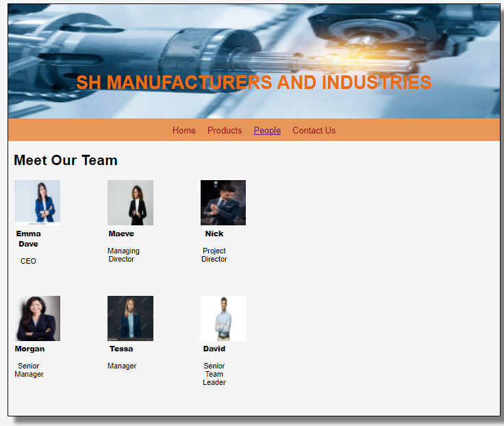

# Web Design for a Software Product Company

## AIM:

To design a static website for a software product company company.

## DESIGN STEPS:

### Step 1:

Requirement collection.

### Step 2:

Creating the layout using HTML and CSS.

### Step 3:

Updating the sample content.

### Step 4:

Choose the appropriate style and color scheme.

### Step 5:

Validate the layout in various browsers.

### Step 6:

Validate the HTML code.

### Step 6:

Publish the website in the given URL.

## PROGRAM :
1. HOME PAGE
```
<!DOCTYPE html>
<html lang="en">
  <head>
    <title>EduSoft Private Limited</title>
    <link rel="stylesheet" href="./css/layout.css" />
    <link rel="icon" href="./img/icon.png" type="image/x-icon" />
  </head>

  <body>
    <div class="container">
      <div class="banner"> SH MANUFACTURERS AND INDUSTRIES </div>
      <div class="menu">
        <div class="menuitemselected"><a href="/static/home.html">Home</a></div>
        <div class="menuitem"><a href="/static/products.html">Products</a></div>
        <div class="menuitem"><a href="/static/people.html">People</a></div>
        <div class="menuitem"><a>Contact Us</a></div>
      </div>
      <div class="content">
        <div class="homecontent">
          <h1>About Us</h1>
          
          <div class="contenttext">
            At Tally, we believe in the power of technology,engineering and
            innovations to make business owners efficient, empowered and happier,
            so they can focus on what matters most for their business. 
            We are one of the manufacturer of Presicion Machined Components in Chennai.
            We are having more than 15 years of experience,and have now expanded ourselves
            in a much wider perspective in this field.
            <br>
             SH MANUFACTURERS AND INDUSTRIES, is at the cutting edge of what we do in our domain,
            and are driven by our philosophy—our philosophy to constantly innovate to continue to remain relevant to 
            our customers. It is our innovation that also allows us to offer greater value.
            From the initial R&D stages to the final labeling and packaging of our finished goods, all of our products
            have been developed precisely for our customers. We have stood out since our inception for the quality and 
            reliability of our products and services. We ensure the best possible quality is a priority and 
            a strong corporate value. Innovation is one of our core competencies. We are committed to research, 
            development and innovation as well as to gain a deep understanding of our customers needs. 
            The result high quality products that you can rely on, each and every time.
            
          </div>
        </div>
      </div>
      <div class="footer">
        Copyright &#169; 2021 SH MANUFACTURERS AND INDUSTRIES, Developed by Shavedha.
      </div>
    </div>
  </body>
</html>
```
2.PRODUCT PAGE
```
<!DOCTYPE html>
<html lang="en">
  <head>
    <title>SH MANUFACTURERS AND INDUSTRIES</title>
    <link rel="stylesheet" href="./css/layout.css" />
    <link rel="icon" href="./img/icon.png" type="image/x-icon" />
  </head>

  <body>
    <div class="container">
      <div class="banner">SH MANUFACTURERS AND INDUSTRIES</div>
      <div class="menu">
        <div class="menuitem"><a href="/static/home.html">Home</a></div>
        <div class="menuitemselected">
          <a href="/static/products.html">Products</a>
        </div>
        <div class="menuitem"><a href="/static/people.html">People</a></div>
        <div class="menuitem"><a>Contact Us</a></div>
      </div>
      <div class="content">
        <div class="productcontent">    
          <h1>Our Premium Products</h1>
          <div class="productitems">
            <table>
            <tr> 
            <td>
              <div class="productitem"> 
                  <div class="itemimage">
                  
                  </div>
                  <div class="itemname">Tally Gold </div>
                  <div class="itemprice">Price: Rs.40,000.00 </div>
              </div> 
            </td>
            <td>
              <div class="productitem"> 
                  <div class="itemimage">
                  
                  </div>
                  <div class="itemname">Tally Silver</div>
                  <div class="itemprice">Price: Rs.10,000.00 </div> 
            </td>
            <td>
              <div class="productitem"> 
                <div class="itemimage">
                
                </div>
                <div class="itemname">Precicut Milling Machine </div>
                <div class="itemprice">Price: Rs.90,000.00 </div> 
        </td>
        <td>
          <div class="productitem"> 
            <div class="itemimage">
            
            </div>
            <div class="itemname">Bench Grinding Machine </div>
            <div class="itemprice">Price: Rs.60,000.00 </div>
            </td> </tr>
            <tr>
            <td>
              <div class="productitem"> 
                <div class="itemimage">
                
                </div>
                <div class="itemname">Accurate Lathe Machine </div>
                <div class="itemprice">Price: Rs.1,00,000.00 </div>
                </td>
                <td>
                  <div class="productitem"> 
                    <div class="itemimage">
                    
                    </div>
                    <div class="itemname">Esteem M1 DR Milling Machine </div>
                    <div class="itemprice">Price: Rs.1,00,000.00 </div>

                </td>
              <td>
                <div class="productitem"> 
                  <div class="itemimage">
                  
                  </div>
                  <div class="itemname">Tire Cutting Press </div>
                  <div class="itemprice">Price: Rs.4,00,000.00 </div>

              </td> 
              <td>
                <div class="productitem"> 
                  <div class="itemimage">
                  
                  </div>
                  <div class="itemname">Bias cutter </div>
                  <div class="itemprice">Price: Rs.4,00,000.00 </div>

              </td>
            </tr>
            <tr>
              <td>
                <div class="productitem"> 
                  <div class="itemimage">
                  
                  </div>
                  <div class="itemname">NU vertical upwards </div>
                  <div class="itemprice">Price: Rs.80,000.00 </div>

              </td>
              <td>
                <div class="productitem"> 
                  <div class="itemimage">
                  
                  </div>
                  <div class="itemname">Two speed Gearbox </div>
                  <div class="itemprice">Price: Rs.50,000.00 </div>

              </td>
              <td> 
                <div class="productitem"> 
                  <div class="itemimage">
                  
                  </div>
                  <div class="itemname">Digestor Top Separator</div>
                  <div class="itemprice">Price: Rs.1,00,000.00 </div>
              </td>
              <td>
                <div class="productitem"> 
                  <div class="itemimage">
                  
                  </div>
                  <div class="itemname">Ball Mill Drive </div>
                  <div class="itemprice">Price: Rs.2,00,000.00 </div>
              </td>
            </tr>

              </div>
          </div>
          </div>        
      </div>
      <div class="footer">
        Copyright &#169; 2021 EduSoft Private Limited, Developed by Y SHAVEDHA.
      </div>
    </div>
  </body>
</html>
```
3.PEOPLE PAGE
```
<!DOCTYPE html>
<html lang="en">
  <head>
    <title>SH MANUFACTURERS AND INDUSTRIES</title>
    <link rel="stylesheet" href="./css/layout.css" />
    <link rel="icon" href="./img/icon.png" type="image/x-icon" />
  </head>

  <body>
    <div class="container">
      <div class="banner">SH MANUFACTURERS AND INDUSTRIES</div>
      <div class="menu">
        <div class="menuitem"><a href="/static/home.html">Home</a></div>
        <div class="menuitem">
          <a href="/static/products.html">Products</a>
        </div>
        <div class="menuitemselected"><a href="/static/people.html">People</a></div>
        <div class="menuitem"><a>Contact Us</a></div>
      </div>
      <div class="content">
        <div class="productcontent">    
          <h1>Meet Our Team</h1>
          <table>
            <tr> 
            <td>
              <div class="productitem"> 
                  <div class="itemimage">
                  
                  </div>
                  <div class="itemname">Emma Dave </div> <br>
                  <div class="itemprice"> CEO  </div> 
                </td>
            <td>
                <div class="productitem"> 
                    <div class="itemimage">
                    
                    </div>
                    <div class="itemname"> Maeve </div> <br>
                    <div class="itemprice">Managing Director</div>
                </td>
                <td>
                    <div class="productitem"> 
                        <div class="itemimage">
                        
                        </div>
                        <div class="itemname">Nick</div> <br>
                        <div class="itemprice">Project Director</div>

                </td>  
            </tr>
            <tr>
                <td>
                    <div class="productitem"> 
                        <div class="itemimage">
                        
                        </div>
                        <div class="itemname">Morgan</div> <br>
                        <div class="itemprice">Senior Manager</div>
                    </td>
                    <td>
                        <div class="productitem"> 
                            <div class="itemimage">
                            
                            </div>
                            <div class="itemname">Tessa</div><br>
                            <div class="itemprice"> Manager</div>

                    </td>
                    <td>
                        <div class="productitem"> 
                            <div class="itemimage">
                            
                            </div>
                            <div class="itemname">David</div> <br>
                            <div class="itemprice">Senior Team Leader</div>
                    </td>

            </tr>    
            </table>
            </div>
            </div>
        </body>
        </html>
```
4.CONTACT US PAGE
```
<!DOCTYPE html>
<html lang="en">
  <head>
    <title>SH MANUFACTURERS AND INDUSTRIES</title>
    <link rel="stylesheet" href="./css/layout.css" />
    <link rel="icon" href="./img/icon.png" type="image/x-icon" />
  </head>

  <body>
    <div class="container">
      <div class="banner">SH MANUFACTURERS AND INDUSTRIES</div>
      <div class="menu">
        <div class="menuitem"><a href="/static/home.html">Home</a></div>
        <div class="menuitem">
          <a href="/static/products.html">Products</a>
        </div>
        <div class="menuitem"><a href="/static/people.html">People</a></div>
        <div class="menuitemselected"><a href="/static/contactus.html">Contact Us</a></div>
      </div>
      <div class="contactus" background-image="url(/static/img/cbg.jpg")>
          OFFICE ADDRESS <br>
          <hr style="height:2px;border-width:5px;color:#e6752f;background-color: #e6752f">
          
          120F, 
          Ansa Indl Estate Saki Vihar Road Andheri,<br>
          Chennai,<br>
          400072,<br>
          India<br>

          CONTACT ADDRESS<br>
          <hr style="height:2px;border-width:5px;color:#e6752f;background-color: #e6752f">
          
          Tel: 044-56238952
               044-85452142
          Fax: 0091-44-27281158
          E-mail: shv4528@manufav.com
          <br>
           For Service Queries or Complaints: sales.fhr@manufav.com
        
        </div>
        <div class="footer">
            Copyright &#169; 2021 EduSoft Private Limited, Developed by Y SHAVEDHA.
          </div>

      </div>
      </body>
      </html>
```

## OUTPUT:
Home page:


Products page:

People page:

Contact us page:
 

## Result:

Thus a website is designed for the software product company and the HTML,CSS code are validated.
